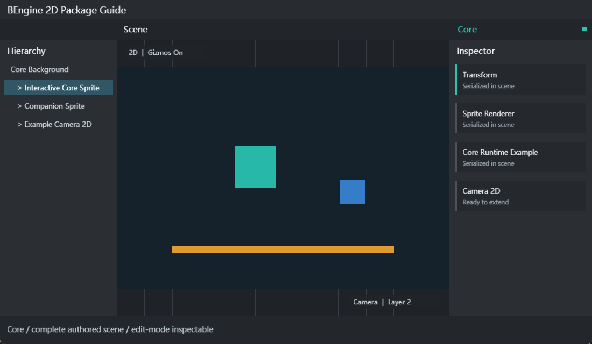

# BEngine Core

BEngine Core 是引擎与编辑器的内置基础层，提供 2D Scene、GameObject、Component、Transform、Camera2D、Sprite、粒子、资源系统、序列化、输入、生命周期和 Unity 风格编辑器扩展 API。Core 始终可用，不需要在 `Packages.yaml` 中启用，也不依赖 Animation、Physics2D、Navigation2D、TiledMap 或 UIElements。



## 包概览与依赖

Core 是所有工程与扩展包的共同依赖，也是唯一不通过 Package Manager 卸载的功能集合。扩展包只允许从自身指向 Core；Core 不保存具体扩展包注册，保证运行时可按工程清单组合。

### 程序集与目录

| 项目 | 用途 | 运行时可用 |
| --- | --- | --- |
| `BEngine` | Scene、GameObject、组件、资源、渲染、输入和数学 API | 是 |
| `BEngine.Editor` | 编辑器宿主、Inspector、菜单、窗口、Package Manager 和资源导入 | 否 |
| `BEngine.Launcher` | 工程选择与编辑器启动 | 否 |
| `BEngine.Player` | 导出游戏的通用运行时入口 | 是 |
| `Resources` | 默认 Shader 等运行时资源 | 是 |
| `Editor` | 图标、离线文档、示例和 AI Skill | 否 |

Core 使用 `Microsoft.Extensions.DependencyInjection` 管理宿主与 Scene scope，并使用 YAML 文档保存工程、场景、Prefab 和资源元数据。运行时是单线程模型；编辑器可以在后台执行扫描、编译、哈希和文件 IO，但不能从后台线程修改场景对象。

## 可导入示例

| 示例 | 导入目录 | 场景 | 内容 |
| --- | --- | --- | --- |
| Core Getting Started | `Assets/Examples/CoreGettingStarted` | `res/Core.scene.yaml` | MonoBehaviour 生命周期、输入、协程、Transform、SpriteRenderer、Camera2D 和 EditorWindow |

### 快速开始：从 Import 到 Play

1. 启动编辑器，打开 `Window > Package Manager`。
2. 在左侧选择 `BEngine Core`，切换到 `Examples` 页签。
3. 在 `Core Getting Started` 行点击 `Import`。导入完成后按钮会变为 `Reimport`。
4. 在 Project 窗口打开 `Assets/Examples/CoreGettingStarted/res/Core.scene.yaml`。
5. 等待脚本编译完成，确认 Console 没有错误，然后点击顶部 Play 按钮。
6. 使用 Horizontal/Vertical 输入轴移动前景 Sprite，按 `Space` 切换颜色；Console 会显示 Awake、OnEnable、Start 和协程日志。
7. 停止 Play。运行时创建的 Camera、背景和伴随 Sprite 会随运行镜像丢弃，原始 Scene 资产不会被改写。
8. 打开 `Tools > Examples > BEngine Editor Window` 查看 `MenuItem`、EditorWindow 生命周期、Selection 和 GenericMenu 示例。

`Reimport` 默认复用未变化文件，并保留本地修改。需要一份干净参考时，先复制导入目录，再按 Package Manager 的提示选择覆盖策略。

## 组件字段表

| 组件 | 字段 | 说明 |
| --- | --- | --- |
| `Transform` | `localPosition`, `localRotation`, `localScale` | 本地二维位置、角度和缩放 |
| `Transform` | `position`, `rotation`, `lossyScale` | 计算后的世界值；层级变化由 `SetParent` 管理 |
| `Camera2D` | `size` | 正交相机半高，最小值为 0.001 |
| `Camera2D` | `backgroundColor`, `clearMode` | Color、DepthOnly 或 Nothing 清屏策略 |
| `Camera2D` | `priority`, `isMain` | 多相机按 priority 从小到大稳定渲染 |
| `Camera2D` | `cullingMask` | 独立的 63 位 Layer 掩码；使用 `SortingLayer.ToMask`、`LayerMask.MaskForLayer` 或 `LayerMask.GetMask` 创建 |
| `Camera2D` | `viewportRect` | 左下角原点、0 到 1 的归一化视口 |
| `Renderer2D` | `sortingLayer`, `orderInLayer`, `opacity` | 所有 2D Renderer 共用的排序与透明度字段 |
| `SpriteRenderer` | `sprite`, `size`, `pivot`, `useSpritePivot` | Sprite 资源、尺寸与轴心 |
| `SpriteRenderer` | `color`, `flipX`, `flipY`, `material` | 着色、翻转与材质；Atlas 由 Sprite 引用自动反查 |
| `ParticleSystem2D` | `duration`, `loop`, `playOnAwake`, `emissionRate` | 发射周期与自动播放 |
| `ParticleSystem2D` | `startLifetime`, `startSpeed`, `startDirection`, `startSize` | 新生粒子的寿命、速度、方向和尺寸 |
| `ParticleSystem2D` | `startColor`, `startRotation`, `startAngularVelocity` | 新生粒子的颜色和旋转 |
| `ParticleSystem2D` | `maxParticles`, `sprite`, `atlas`, `material` | 容量、视觉资源与合批键 |

Sorting Layer 的值是连续自然编号 `1..63`，不是位值。工程默认提供五个具有稳定内建身份的 Layer；它们可以重命名和调整顺序，但不能删除。自定义 Layer 可以增加、删除、重命名和排序，排序变化后编号仍保持连续。Camera 与 Physics 使用的 Layer Mask 是另一种位掩码表示：不要直接按位组合 Layer 编号，应使用 `SortingLayer.ToMask(layer)`、`LayerMask.MaskForLayer(layer)` 或按名称调用 `LayerMask.GetMask(...)`。内建 UI Layer 通过稳定身份定位，其当前编号可随排序变化。最终渲染顺序由 Layer、Order in Layer、Hierarchy、透明度和提交顺序共同决定，Material、Shader、Atlas 决定相邻提交能否合批。

## 资源字段表与导入参数

| 资源 | 关键字段或扩展名 | 说明 |
| --- | --- | --- |
| `Scene` | `*.scene.yaml` | 保存 GameObject、Transform 和 Component 数据 |
| `PrefabAsset` | `*.prefab.yaml` | 可实例化并 Apply/Revert 的对象层级 |
| `Sprite` | `.png` + `.meta`: `textureType`, `spritePivotX/Y` | 将 PNG 的 Texture Type 设为 Sprite；同一图片可赋给 SpriteRenderer 或加入 Atlas |
| `TextureAtlas` | `*.atlas.yaml`: `MaxSize`, `Padding`, `Extrude`, `Sources` | `Sources` 是 Sprite 数组，以 `ownerGuid + localIdentifier` 保存稳定引用；在 `Window > 2D > Texture Atlas` 构建 |
| `Material` | `*.material.yaml`: `shader`, `color`, `renderQueue` | 可保存 Color、Fix64、Vector4 和 Int 属性 |
| `GUISkin` | `*.guiskin.yaml`: 全部 `EditorStyles` 样式槽, `customStyles` | 编辑器主题资产；继承 `BAsset`，仅存在于 `BEngine.Editor` 程序集 |
| `Texture` | `.png` | Inspector Import Settings 写入相邻 `.meta`；当前运行时解码器仅支持 PNG |
| `TextureImporter` | `compressionFormat`, `filterMode`, `wrapMode` | 请求的压缩、过滤和寻址模式 |
| `TextureImporter` | `generateMipMaps`, `maxTextureSize`, `pixelsPerUnit` | MipMap、32 到 16384 的 2 次幂尺寸和 PPU |
| `Font`, `Shader`, `Script`, `TextAsset` | 对应源文件 | 均遵循 BAsset 的稳定路径和 GUID 契约 |

Inspector 中修改 Texture 导入参数后必须点击 `Apply`；`Revert` 会重新读取 `.meta`。压缩格式是导入请求，当前后端不支持的 GPU 转码不会伪装为已完成，但请求会稳定保留。

### 统一 BAsset 与导入链路

工程资源不再区分两套资产基类：Scene、Texture、Font、Shader、Material、TextureAtlas、ScriptableObject 资产等都直接或间接继承统一的 `BAsset`。Sprite 是 TextureImporter 从 Texture 创建的 `BObject` SubAsset，以主 Texture 的 GUID 和非零 `localIdentifier` 标识，不是第二种资产基类。

编辑器读取链路是 `Source -> AssetDatabase -> AssetImporter -> Artifact -> BAsset`。Source 是用户磁盘中的原始文件；AssetDatabase 管理工程路径、GUID、Source/Artifact 地址、哈希与 SubAsset 身份；AssetImporter 把源数据转换到 Artifact；AssetDatabase 再从 Artifact 创建并缓存 BAsset。Assets 面板展示 AssetDatabase 的资源记录，而不是直接枚举磁盘文件。重新导入、刷新、移动或删除资源时必须使相关缓存失效。

需要把可序列化资源写回源文件时，编辑器内部通过泛型 `Document<TAsset>` 在 BAsset 与磁盘文档之间转换；该桥梁不公开，也不形成新的资产类型层级。运行时只允许从 AssetBundle 读取 BAsset，并由渲染后端按需创建 GPU 对象；运行时及 Play 镜像都不能把资源保存回工程文件。

## 运行时 API

| API | 用途 |
| --- | --- |
| `scene.CreateGameObject(name)` | 在指定 Scene 创建对象 |
| `gameObject.AddComponent<T>()` | 添加组件并自动满足 `RequireComponent` |
| `GetComponent<T>()` / `TryGetComponent<T>()` | 查询当前对象组件 |
| `scene.QueryComponents<T>()` | 查询 Scene 中所有匹配组件 |
| `transform.Translate/Rotate/SetParent` | 2D 空间变换与层级操作 |
| `SceneManager.LoadScene` | Single 或 Additive 加载场景 |
| `StartCoroutine`, `Invoke`, `CancelInvoke` | MonoBehaviour 定时与协程 |
| `BAsset.Load<T>(path)` | 按 Assets/Packages 稳定路径加载资源 |
| `BAsset.LoadSubAsset<T>(path, localIdentifier)` | 用主资源路径和局部 ID 加载 SubAsset |
| `Object.Instantiate`, `Object.Destroy` | 复制与销毁运行时对象 |

```csharp
using BEngine;

[AddComponentMenu("Gameplay/Player Mover")]
public sealed class PlayerMover : MonoBehaviour
{
    public Fix64 speed = 4;
    private SpriteRenderer? _renderer;

    public override void Awake() => _renderer = GetComponent<SpriteRenderer>();

    public override void Update()
    {
        var input = new Vector2(Input.GetAxisRaw("Horizontal"), Input.GetAxisRaw("Vertical"));
        transform.Translate(input * speed * Time.deltaTime, Space.World);
        if (Input.GetKeyDown(KeyCode.Space) && _renderer is not null)
            _renderer.color = _renderer.color == Color.white ? Color.red : Color.white;
    }
}
```

生命周期顺序为 `Awake -> OnEnable -> Start -> FixedUpdate/Update/LateUpdate -> OnDisable -> OnDestroy`。运行时修改只发生在 Play 镜像；停止 Play 后编辑器继续显示播放前的 Scene 和组件数据。

## 编辑器 API

| API/特性 | 用途与注册方式 |
| --- | --- |
| `[MenuItem("Tools/...")]` | 程序集加载时自动发现静态菜单方法；同路径布尔方法用于验证 |
| `EditorWindow.GetWindow<T>()` | 创建或聚焦可停靠窗口 |
| `[CustomEditor(typeof(T), true)]` | 为目标类型及可选子类注册 Inspector |
| `[CustomPropertyDrawer(typeof(T))]` | 为字段类型或 PropertyAttribute 注册 Drawer |
| `SerializedObject`, `SerializedProperty` | 统一多选、Undo 和字段绘制；普通嵌套对象以 Foldout 递归显示并按深度缩进 |
| `EditorGUI.ObjectField` | 为 BObject/BAsset 字段提供选择、拖放和类型校验 |
| `Undo.RecordObject`, `EditorUtility.SetDirty` | 正确记录编辑态修改 |
| `AssetDatabase.LoadAssetAtPath<T>()` | 通过工程路径加载编辑器资源 |
| `AssetDatabase.LoadAllAssetsAtPath` | 返回主资源及其导入表示、内嵌和文件型 SubAsset |
| `AssetDatabase.LoadAllAssetRepresentationsAtPath` | 只返回指定主资源的 SubAsset 表示 |
| `AssetDatabase.AddObjectToAsset` / `RemoveObjectFromAsset` | 向主资源添加或移除内嵌 SubAsset |
| `AssetDatabase.IsMainAsset` / `IsSubAsset` | 判断对象在资源文件中的身份 |
| `AssetDatabase.TryGetGUIDAndLocalFileIdentifier` | 取得主资源 GUID 与对象 localIdentifier |
| `Selection.activeObject` | 同步 Project、Hierarchy、Scene 和 Inspector 选择 |
| `ScenePickingProviderRegistry.Register` | 让外部 Renderer 参与 Scene 点击选取 |
| `GUI.skin` | 获取或设置当前 `GUISkin`；控件从中解析对应的默认 `GUIStyle` |
| `EditorAppearance.SetSkin` | 将指定 Skin 应用到整个编辑器并重绘所有窗口 |

### Project 窗口布局

Project 窗口的菜单可以在 One Column 与 Two Column 间切换。左侧目录始终分为 Assets 和 Packages 两个独立滚动区域；把鼠标移到两者之间的横线后上下拖动，可以直接调整下方 Packages 区域的高度。分隔高度会随编辑器布局保存，并在窗口缩小时限制在两个区域都可操作的范围内。

Two Column 模式右侧按网格显示当前文件夹的直接子项。文件与文件夹名称都以缩略图中心为轴水平居中；长名称保持在单元范围内裁剪并显示省略号，悬停仍可通过 Tooltip 查看完整名称。Project 中的文件标签隐藏最后一段后缀，例如 `Spark.png` 显示为 `Spark`，`Showcase.atlas.yaml` 显示为 `Showcase.atlas`；磁盘文件名和资源路径不变。

Project 与 Hierarchy 的 TreeView 只有在鼠标于同一行按下并抬起时才提交 Selection；按下后移出该行或进入拖拽不会改变 Selection。因此可以直接把 Project/Hierarchy 的 BObject 拖到未锁定 Inspector 的 ObjectField，Inspector 不会在拖拽起点切换目标。拖拽开始后光标会切换为拖拽样式，ObjectField 仅在类型和 `allowSceneObjects` 规则通过时接受赋值。

文本输入框按操作系统键盘重复节奏处理长按 `Backspace`、`Delete`、左/右方向键、`Home` 和 `End`。首次按键立即执行，越过系统重复延迟后连续执行，按键抬起或输入框失焦时立即停止；因此删除、移动光标不需要反复单击按键。

### SubAsset 身份与生命周期

SubAsset 不拥有独立的顶层资源身份，而由“主资源 GUID + 非零 `localIdentifier`”唯一标识；主资源自身的 `localIdentifier` 为 `0`。序列化 BAsset 子资源引用时使用 `guid:<主资源 GUID>#subasset=<localIdentifier>`，资源移动或重命名后引用仍然稳定。`AssetDatabase.TryGetGUIDAndLocalFileIdentifier` 返回同一组身份，`LoadAllAssetsAtPath` 返回主资源和所有表示，`LoadAllAssetRepresentationsAtPath` 只返回其 SubAsset。

使用 `AssetDatabase.AddObjectToAsset(objectToAdd, mainAssetOrPath)` 创建内嵌 SubAsset，完成字段修改后按常规调用 `EditorUtility.SetDirty`/保存；使用 `RemoveObjectFromAsset` 将其移出主资源。不能让 SubAsset 再拥有子资源，也不能手动移除由 Importer 管理的 Sprite 等导入表示。Project 把 SubAsset 显示为主资源节点的子项；展开主资源即可查看、选择和拖拽，ObjectField、Inspector 与枚举 API 使用同一对象身份。

### 自定义编辑器主题

`Preferences` 和 `Project Settings` 都是普通、可持久化布局的 `EditorWindow`，可以像 Scene、Inspector 一样停靠、拖出和重新停靠；重复打开菜单会定位并聚焦已有窗口。Float 使用独立原生窗口，可以移动到任意显示器并拖回主窗口 Dock；显示器拓扑变化后会把离屏窗口恢复到最近的可见工作区。Float 内的 Popup 留在所属窗口，未聚焦 Float 降频绘制，最小化时停止 GPU 提交。`Preferences > General` 的 Editor Scale 使用带精确数值输入的 Slider，范围固定为 `0.5–1.8`。

`GUISkin` 继承 `BAsset`。Preferences 创建的自定义主题以 `*.guiskin.yaml` 保存在 `Output/EditorData/Preferences/Themes`，可以创建多份。每个 Skin 直接包含 `EditorStyles` 暴露的完整样式集合，以及可由扩展包增加的 `customStyles`；不存在独立的 SkinColors/Palette。`GUIStyle` 保存 Normal、Hover、Active、Focused、On 与 Disabled 状态的文字色、背景色、边框色、`Texture` 背景图片和布局参数。

1. 打开 `Edit > Preferences > Theme`，在列表查看 Light、Dark、Classic 和所有自定义 Skin。
2. 内置 Light、Dark、Classic 可以通过对应 ObjectField 选中并在 Inspector 查看；样式与状态 Foldout 可以展开，但字段只读，资源不能修改或删除。
3. 点击 `New` 会复制当前主题，并在 `Output/EditorData/Preferences/Themes` 创建一份名称唯一的 `*.guiskin.yaml`。
4. 点击 Skin 的 ObjectField 会把它设为 `Selection.activeObject`，随后在 Inspector 编辑内置样式和 `customStyles`。每个 `GUIStyleState.backgroundImage` 使用 Texture ObjectField；点击 Inspector 的 Apply 保存。
5. 回到 Preferences 点击 `Set` 将该 Skin 应用到整个编辑器。`Delete` 只对自定义 Skin 可用；删除正在使用的 Skin 后会回到 Dark。
6. 每个自定义 Skin 行下方的 Light、Dark、Classic 按钮可一键复制完整预设，然后继续微调各个 GUIStyle。

扩展编辑器时，`GUI`、`EditorGUI`、`GUILayout`、`EditorGUILayout` 和 `EditorToolbar` 的绘制重载都可以接收 `GUIStyle?`。传入具体样式会覆盖主题；传入 `null` 则按控件语义回退到当前 `GUI.skin` 的对应槽，例如 Button 使用 `GUI.skin.button`、文本输入使用 `GUI.skin.textField`、工具栏按钮使用 `GUI.skin.toolbarButton`。因此扩展窗口应优先使用 `null` 或 `EditorStyles`，只在需要包专用外观时使用 `customStyles`。

```csharp
var skin = AssetDatabase.LoadAssetAtPath<GUISkin>("Assets/Editor/Studio.guiskin.yaml");
if (skin is not null)
    EditorAppearance.SetSkin(skin); // 应用全局主题并重绘窗口

GUI.Button(buttonRect, new GUIContent("Run"), style: null); // 当前 skin.button
var accent = GUI.skin.FindStyle("MyPackage/AccentButton") ?? GUI.skin.button;
GUILayout.Button("Build", accent);
```

直接赋值 `GUI.skin` 适合底层宿主或测试；编辑器工具应调用 `EditorAppearance.SetSkin`，以同步主题状态、外观通知和窗口重绘。

## 完整编辑器工作流

1. 从 `File > New Scene` 创建场景，并立刻保存到 `Assets/Scenes`。
2. 使用 `GameObject > Camera 2D` 创建相机；在 Inspector 设置 size、priority、clearMode、cullingMask 和 viewportRect。
3. 在 Project 选中 PNG，在 Inspector 将 `Texture Type` 设为 `Sprite`，按需调整 Pivot/PPU，然后点击 `Apply`；使用 `GameObject > 2D Object > Sprite` 创建对象并把这张图片赋给 SpriteRenderer。
4. 需要 Atlas 时，从 `Assets > Create > 2D > Texture Atlas` 创建 Atlas，在 Atlas Inspector 或 `Window > 2D > Texture Atlas` 通过 Sprite ObjectField 添加图片并 Build。清单保存 Sprite 的 ownerGuid 与 localIdentifier；生成的 PNG 以 Atlas GUID 和保留 localIdentifier 注册为 SubAsset，在 Project 展开 Atlas 节点后显示，而不成为独立顶层资源。同一图片仍直接用于 SpriteRenderer，无需创建第二份资源。
5. 在 `Edit > Project Settings > Tags and Layers` 管理 Tag 与全部 Sorting Layer。Layer 使用连续自然编号 `1..63`；五个内建层可重命名和排序但不可删除，自定义层可增删、重命名和排序。
6. 用 W/E/R 切换移动、旋转、缩放 Handle；Scene 点击对象会同步 Hierarchy 选择。
7. 进入 Play 验证运行时行为。Play 期间不要尝试保存 Scene 或组件变更；停止后原数据会恢复。
8. 检查 Game View 的分辨率和 Status 统计，再通过 `File > Save Scene` 保存编辑态修改。

## 扩展 Core

### 可运行 EditorWindow

把以下脚本放入 Editor 程序集。`MenuItem` 和 `EditorWindow` 不需要手工调用注册器，编辑器在程序集加载后自动发现。

```csharp
using BEngine;
using BEngine.Editor;

public sealed class SelectionInfoWindow : EditorWindow
{
    [MenuItem("Tools/My Package/Selection Info")]
    private static void Open() => GetWindow<SelectionInfoWindow>("Selection Info");

    protected override void OnEnable() => Selection.selectionChanged += Repaint;
    protected override void OnDisable() => Selection.selectionChanged -= Repaint;

    protected override void OnGUI()
    {
        EditorGUILayout.LabelField("当前选择", EditorStyles.boldLabel);
        EditorGUILayout.LabelField(Selection.activeObject?.name ?? "None");
    }
}
```

### 注册 Scene 运行系统

实现 `ISceneRuntimeSystem` 后可通过扩展包的 `IEngineServiceModule` 注入。模块会在包程序集启用时发现，禁用包时作用域和注册会被清理。

```csharp
using BEngine;
using BEngine.DependencyInjection;
using Microsoft.Extensions.DependencyInjection;
using Microsoft.Extensions.DependencyInjection.Extensions;

public sealed class CombatActor : MonoBehaviour
{
    public void Tick(Fix64 deltaTime) => transform.Rotate(deltaTime * 45);
}

public sealed class CombatSystem : ISceneRuntimeSystem
{
    public string packageId => "com.example.combat";
    public int order => 200;
    public void Update(Scene scene, Fix64 deltaTime)
    {
        foreach (var actor in scene.QueryComponents<CombatActor>())
            actor.Tick(deltaTime);
    }
}

public sealed class CombatModule : IEngineServiceModule
{
    public void ConfigureServices(IServiceCollection services, EngineServiceContext context) =>
        services.TryAddEnumerable(ServiceDescriptor.Transient<ISceneRuntimeSystem, CombatSystem>());
}
```

## 调试与常见问题

| 问题 | 检查与处理 |
| --- | --- |
| Game 窗口没有画面 | 确认 Scene 中有启用的 Camera2D、cullingMask 包含对象层、viewportRect 非零且对象位于正交范围内 |
| Scene 能看到但 Game 看不到 | 检查 Renderer sortingLayer、Camera cullingMask、Transform、opacity 和 Camera size |
| Sprite 只显示纯色 | 检查图片的 `Texture Type = Sprite` 是否已 Apply、源图 `.meta` 和 Atlas 是否已 Build；未指定 Sprite 时纯色 Quad 是正常行为 |
| 不能合批 | Material、Shader、解析后的 Atlas 必须相同，而且排序后必须相邻 |
| Texture 参数重选后丢失 | 修改后点击 Apply，并确认源文件旁 `.meta` 可写；Reimport 后查看 Console |
| Play 停止后对象消失 | Play 中创建的对象属于运行镜像，停止后丢弃是设计行为 |
| Play 中修改被保存 | 不应发生；记录 Editor 日志并检查自定义工具是否绕过 Play 状态直接写 YAML |
| Add Component 找不到脚本 | 检查编译错误、程序集定义依赖和脚本类型是否为非抽象 Component |
| 包菜单或 Drawer 不出现 | 确认代码位于 Editor 程序集，等待编译完成并查看 Console 的功能边界错误 |
| 文档或示例按钮不可用 | Play Mode、编译或包切换期间会禁用导入；回到 Edit Mode 后重试 |
| Example/Editor 启动失败 | 从 Hub 启动时，Hub 会等到 Editor 首帧报告 Ready；托管启动异常、原生崩溃、提前退出或启动超时都会由 Hub 弹窗，并显示实际诊断日志路径。直接运行 `BEngine.Editor.exe` 时，Editor 会用原生弹窗报告可捕获的启动异常 |

启动布局可以恢复选中的页签与逻辑焦点，但不得在主原生窗口完成初始化前调用原生 `Focus`；真正的窗口聚焦由首帧之后的窗口生命周期接管。可捕获的 Editor 启动异常写入 `Output/EditorData/Logs/EditorBootstrap.log`；Editor 无法自行记录的崩溃或超时由 Hub 写入 `Output/EditorData/Logs/EditorStartup.log`。弹窗中的路径应始终指向本次故障实际生成的日志。

离线网页手册位于 `Editor/Doc/index.html`，可从 `Help > Documentation` 或 Package Manager 打开。

旧项目中的 `*.sprite.yaml` 只保留读取兼容；新内容不要再创建或编辑这类描述符。
