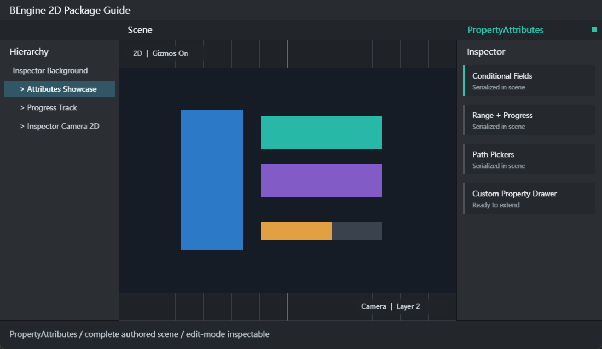

# Property Attributes

Property Attributes 为 BEngine 的 GPU IMGUI Inspector 提供声明式字段布局、条件显示、验证、输入控件、路径选择和内联操作。包 ID 为 `com.bengine.property-attributes`，运行时程序集 `BEngine.PropertyAttributes` 只保存 Attribute 元数据，编辑器程序集 `BEngine.PropertyAttributes.Editor` 负责 `SerializedProperty` 和 `PropertyDrawer` 绘制；它只依赖 Core，不依赖 UIElements。



## 包概览与依赖

1. 打开 `Window > Package Manager`，选择 `Property Attributes` 并启用。
2. 运行时组件脚本的程序集定义引用 `BEngine.PropertyAttributes`。
3. 自定义 Drawer 放在 Editor 程序集，并同时引用 `BEngine.Editor` 和包含自定义 Attribute 的运行时程序集。
4. 包禁用后，使用这些 Attribute 的脚本无法解析，因此不要在仍被场景脚本引用时移除包。

该包没有运行时 Component、Scene System 或资源格式。所有内置 Attribute 都继承 `ExtendedPropertyAttribute`，最终仍属于 Core 的 `PropertyAttribute`；运行时不会执行 Inspector 绘制逻辑。

## 可导入示例

| 示例 | 导入目录 | 场景 | 内容 |
| --- | --- | --- | --- |
| Inspector Attributes and Drawer | `Assets/Examples/InspectorAttributesAndDrawer` | `res/PropertyAttributes.scene.yaml` | 内置属性以及可运行的 PercentAttribute/PercentDrawer 扩展 |
| Attributes Gallery | `Assets/Examples/AttributesGallery` | `res/AttributesGallery.scene.yaml` | 独立 Inspector 属性画廊、条件字段、路径和 InlineButton |

### 快速开始：从 Import 到 Play

1. 在 Package Manager 选择 Property Attributes，打开 `Examples` 页签。
2. 点击某个示例右侧 `Import`，等待脚本与程序集定义编译完成。
3. Inspector Attributes and Drawer：打开 `Assets/Examples/InspectorAttributesAndDrawer/res/PropertyAttributes.scene.yaml`。
4. Attributes Gallery：打开 `Assets/Examples/AttributesGallery/res/AttributesGallery.scene.yaml`。
5. 在 Hierarchy 选择 `Property Attributes Showcase` 或 `Attributes Gallery Bootstrap`。
6. 在 Inspector 切换 Show Advanced/Lock Advanced、拖动数值、选择 Dropdown、输入无效 Level，并点击 Reset 按钮。
7. 点击 Play，继续观察 Inspector 和 Console；运行时变化只属于 Play 镜像。
8. 停止 Play 后打开示例的 `runtime/*.cs`；第一个示例还包含 `Editor/PercentDrawer.cs`，可直接复制为自定义 Drawer 起点。

## 组件/资源字段表与属性参数

本包没有自有 Component、Scene System 或 BAsset 资源格式；它扩展的是任意组件或资源的可序列化字段。下表即本包的公开字段元数据契约。

| 属性 | 构造参数/字段 | 支持目标 | Inspector 行为 |
| --- | --- | --- | --- |
| `Title` | `title`, `subtitle` | 任意序列化字段 | 在字段前显示标题和可选副标题 |
| `InfoBox` | `message`, `messageType`, `visibleIf` | 任意字段 | 显示 Info/Warning/Error；visibleIf 为真时才显示 |
| `LabelText` | `label` | 任意字段 | 替换默认字段名 |
| `Indent` | `level` | 任意字段 | 增加字段缩进，最小为 0 |
| `ShowIf` / `HideIf` | `conditionMember`, `expectedValue` | 任意字段 | 按字段、属性或零参成员值显示/隐藏 |
| `EnableIf` / `DisableIf` | `conditionMember`, `expectedValue` | 任意字段 | 按条件启用/禁用编辑 |
| `ReadOnly` | 无 | 任意字段 | 保持显示但禁用输入 |
| `Required` | `message` | string、BObject、可空引用 | null、空白字符串或失效对象时显示错误 |
| `ValidateInput` | `validatorMember`, `message`, `messageType` | 任意字段 | 调用 `bool M()` 或 `bool M(T value)` |
| `Clamp` | `minimum`, `maximum` | Integer、Float、Fix64 | 绘制后把值限制在范围内 |
| `MaxValue` | `maximum` | Integer、Float、Fix64 | 只限制最大值 |
| Core `Range` | `min`, `max` | Integer、Float、Fix64 | 使用 Slider/IntSlider 绘制 |
| `MinMax` | `minimum`, `maximum` | Vector2 | X/Y 作为最小/最大值并保持顺序 |
| `ProgressBar` | `minimum`, `maximum`, `title`, `editable` | Float、Fix64 | 显示并可选编辑进度条 |
| `Dropdown` | 固定 `choices` 或 `providerMember` | string、enum | 固定选项或从 IEnumerable provider 动态获取 |
| `Password` | `mask` | string | 使用遮罩字符绘制 |
| `FilePath` | `title`, `filter`, `relativeToProject` | string | 文件对话框，默认保存工程相对路径 |
| `FolderPath` | `description`, `relativeToProject` | string | 文件夹对话框 |
| `AssetPath` | `extension` | string | 从 Assets 起始并按扩展名过滤 |
| `InlineButton` | `methodName`, `label` | 任意字段 | 字段下显示按钮，调用 `void M()` 或 `void M(T value)` |
| `HorizontalLine` | `thickness`, `color` | 任意字段 | 元数据类型已定义；当前 Drawer 尚未专门绘制分隔线 |
| `Prefix` / `Suffix` | `text` | 任意字段 | 元数据类型已定义；当前 Drawer 尚未绘制前后缀 |
| `EnumFlags` | 无 | enum | 元数据类型已定义；当前 Drawer 尚未提供位掩码控件 |

同一字段可以组合多个属性。`ShowIf`、`EnableIf` 等允许多次使用，并以全部条件满足为准。条件名、Provider、Validator 和 Action 都通过目标对象实例反射解析，不支持静态成员。

## 常用组合

```csharp
using BEngine;
using BEngine.PropertyAttributes;

[AddComponentMenu("Gameplay/Character Settings")]
public sealed class CharacterSettings : MonoBehaviour
{
    [Title("角色", "Inspector 验证与条件字段")]
    [Required("名称不能为空")]
    [LabelText("显示名称")]
    public string displayName = "Hero";

    public bool advanced = true;

    [ShowIf(nameof(advanced))]
    [Range(0, 20)]
    [Clamp(1, 12)]
    public Fix64 speed = 5;

    [Dropdown(nameof(Profiles), true)]
    public string profile = "Balanced";

    [ValidateInput(nameof(IsPositive), "等级必须大于 0")]
    public int level = 1;

    [ProgressBar(0, 100, "生命")]
    [InlineButton(nameof(Heal), "回满")]
    public Fix64 health = 75;

    private static readonly string[] ProfileValues = ["Balanced", "Quality", "Performance"];
    private IEnumerable<string> Profiles => ProfileValues;
    private bool IsPositive(int value) => value > 0;
    private void Heal() => health = 100;
}
```

## 运行时 API 与编辑器 API

| API | 所在程序集 | 用途 |
| --- | --- | --- |
| `ExtendedPropertyAttribute` | Runtime | 所有包内属性的共同基类 |
| `ValidationMessageType` | Runtime | Info、Warning、Error |
| `SerializedObject.FindProperty(path)` | Editor | 获取可绘制和可 Undo 的字段代理 |
| `SerializedProperty.propertyType` | Editor | 判断 Integer、Float、String、Vector2、ObjectReference 等类型 |
| `SerializedProperty.boxedValue` | Editor | 通用读取/写入值 |
| `EditorGUI.DefaultPropertyField` | Editor | 自定义 Drawer 不支持某类型时安全回退 |
| `EditorGUI.PropertyField` | Editor | 使用已注册 Drawer 绘制 SerializedProperty |
| `PropertyDrawer.OnGUI` | Editor | 实现字段绘制 |
| `PropertyDrawer.GetPropertyHeight` | Editor | 为多行控件报告稳定高度 |
| `[CustomPropertyDrawer(typeof(T), useForChildren)]` | Editor | 程序集加载后自动注册 Drawer |

`ExtendedPropertyDrawer` 会自动匹配所有 `ExtendedPropertyAttribute` 子类，无需项目手工注册。自定义 Attribute 如果不继承它，则需要自己的 `PropertyDrawer`。

## 完整编辑器工作流

1. 在运行时程序集的组件字段上添加 Attribute；不要从运行时代码引用 `BEngine.Editor`。
2. 先单独添加一个属性并等待编译，确认默认 Inspector 可见，再逐步组合条件、验证和布局属性。
3. Provider 使用实例字段、属性或零参非 void 方法，并返回 `IEnumerable`；Dropdown 会把每项转换为字符串。
4. Validator 使用 `bool M()` 或 `bool M(T value)`；签名错误会导致验证失败。
5. InlineButton 使用 `void M()` 或 `void M(T value)`，避免在按钮中绕过 Undo 修改编辑态对象。
6. 路径字段默认返回工程相对路径；保存前确认路径以 `Assets/` 或所需工程目录开头。
7. 自定义 Drawer 放入 Editor 文件夹/程序集，使用 `SerializedProperty` 写值，并为不支持类型调用 DefaultPropertyField。
8. 在多选对象、窄 Inspector、Play/Stop 和脚本重载后验证布局及值持久化。

## 扩展：可运行 Percent Drawer

运行时程序集：

```csharp
using BEngine;

[AttributeUsage(AttributeTargets.Field | AttributeTargets.Property)]
public sealed class PercentAttribute : PropertyAttribute;
```

Editor 程序集：

```csharp
using BEngine;
using BEngine.Editor;

[CustomPropertyDrawer(typeof(PercentAttribute))]
public sealed class PercentDrawer : PropertyDrawer
{
    public override void OnGUI(Rect position, SerializedProperty property, GUIContent label)
    {
        if (property.propertyType != SerializedPropertyType.Float)
        {
            EditorGUI.DefaultPropertyField(position, property, label, includeChildren: true);
            return;
        }

        var percent = Math.Clamp(property.floatValue * 100f, 0f, 100f);
        property.floatValue = EditorGUI.Slider(
            position, $"{label.text} (%)", percent, 0f, 100f) / 100f;
    }
}
```

注册完全由 `[CustomPropertyDrawer]` 完成。Editor 程序集必须引用定义 `PercentAttribute` 的运行时程序集；重载或禁用包时，Drawer Registry 会失效缓存并重新扫描可用程序集。

## 调试与常见问题

| 问题 | 检查与处理 |
| --- | --- |
| 属性完全不生效 | 确认包已启用、运行时 asmdef 引用 `BEngine.PropertyAttributes`，字段可被 SerializedObject 枚举 |
| ShowIf 总是隐藏 | conditionMember 必须是同一实例上的字段、属性或零参成员；检查拼写和 expectedValue 类型转换 |
| EnableIf 逻辑相反 | `EnableIf(member, false)` 表示成员等于 false 时启用；DisableIf 则在条件为真时禁用 |
| Dropdown 为空 | Provider 必须返回 IEnumerable；不能是静态成员、带参数方法或 void 方法 |
| Validator 总报错 | 使用 `bool M()` 或与字段类型匹配的 `bool M(T value)`，并避免方法抛异常 |
| InlineButton 没有执行 | 方法必须是实例 void 方法，可无参数或接收当前字段值 |
| Clamp 不作用于 Vector2 | Clamp 只处理 Integer/Float/Fix64；范围 Vector2 使用 MinMax |
| 路径不是 Assets 相对路径 | 检查 relativeToProject；AssetPath 从 Application.dataPath 打开但返回工程相对路径 |
| 自定义 Drawer 不出现 | Drawer 必须在 Editor 程序集、有公开无参构造，并添加 CustomPropertyDrawer |
| 自定义 Drawer 导致布局重叠 | GetPropertyHeight 必须包含所有额外行；OnGUI 只能使用分配到的 Rect |
| HorizontalLine/Prefix/Suffix/EnumFlags 没有视觉变化 | 当前版本仅定义元数据，ExtendedPropertyDrawer 尚未实现专用绘制 |
| Play 中修改停止后丢失 | 这是运行镜像隔离；需要持久化的参数应在 Edit Mode 修改并保存 Scene/Asset |

离线网页文档位于 `Editor/Doc/index.html`，Package Manager 可直接打开。
