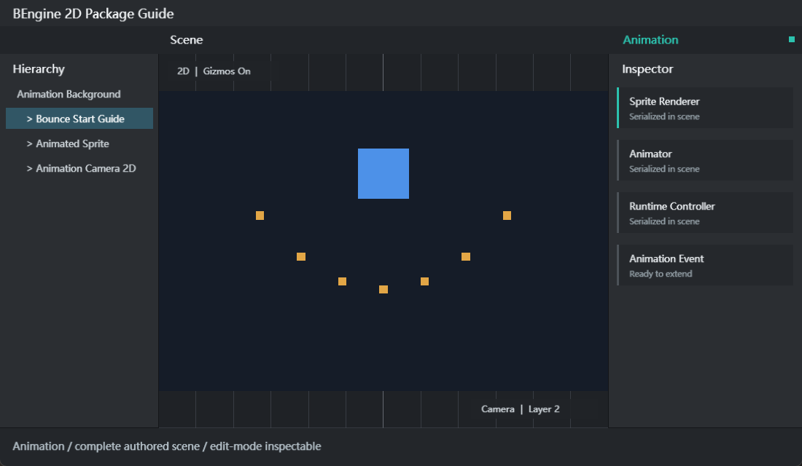

# Animation

Animation 是 BEngine 的确定性 2D 动画包，包 ID 为 `com.bengine.animation`。它提供 Fix64 动画曲线、AnimationClip、AnimationEvent、Animation 组件、Animator Controller、参数、状态、条件和过渡。运行时程序集为 `BEngine.Animation`，编辑器程序集为 `BEngine.Animation.Editor`，只依赖 Core。



## 包概览与依赖

1. 打开 `Window > Package Manager`。
2. 选择 `Animation`，启用包并等待运行时与编辑器程序集加载完成。
3. 工程脚本的程序集定义需要引用 `BEngine.Animation`；仅使用 Core 类型的脚本仍只引用 `BEngine`。
4. 包禁用后 Animation/Animator 组件和动画资源不可解析，因此提交 Scene 前应确认工程包清单包含该包。

动画时间、值和切线使用 `Fix64`；Clip 保存为 `.anim.yaml`，Controller 保存为 `.controller.yaml`。包通过 `IEngineServiceModule` 注入 `AnimationRuntimeSystem`，在 Scene 单线程 Update 阶段以 order 50 更新启用组件。

## 可导入示例

| 示例 | 导入目录 | 场景 | 操作与学习点 |
| --- | --- | --- | --- |
| Animation Getting Started | `Assets/Examples/AnimationGettingStarted` | `res/Animation.scene.yaml` | 运行时创建曲线、事件和 Controller；Space 暂停，Up/Down 调速 |
| Animator State Machine | `Assets/Examples/StateMachine` | `res/StateMachine.scene.yaml` | Bool 与 Trigger 参数、条件过渡、退出时间；Space 切换 Spin，Enter 触发 Pulse |

### 快速开始：从 Import 到 Play

1. 在 Package Manager 选择 Animation，进入 `Examples` 页签。
2. 在需要的示例行点击 `Import`；不要在 Play Mode 或脚本编译期间导入。
3. 等待 Project 窗口出现 `Assets/Examples/AnimationGettingStarted` 或 `Assets/Examples/StateMachine`。
4. 双击对应 `res/*.scene.yaml` 打开场景，确认 Console 没有脚本编译错误。
5. 点击 Play。Getting Started 中观察 Sprite 上下移动并旋转，按 `Space` 暂停/恢复，按 `UpArrow`、`DownArrow` 修改速度。
6. State Machine 中按 `Space` 在 Idle/Spin 间切换，按 `Enter` 进入一次 Pulse 后自动返回 Idle。
7. 选中 Bootstrap 对象并对照 `runtime/*.cs`，观察曲线、Controller 和组件如何在 Start 中构建。
8. 停止 Play 后运行时创建的 Clip、Controller、Camera 和 Sprite 会被丢弃，不会写入 Scene 资产。

## 组件字段表

| 组件 | 字段 | 说明 |
| --- | --- | --- |
| `Animation` | `clipPath` | `.anim.yaml` 的 Assets/Packages 路径；为空时无法播放 |
| `Animation` | `playAutomatically` | Update 首次执行时自动调用 Play |
| `Animation` | `isPlaying` | 只读运行状态 |
| `Animator` | `controllerPath` | `.controller.yaml` 路径；用于持久资源工作流 |
| `Animator` | `runtimeAnimatorController` | 运行时直接赋值的 Controller，不写入 Inspector |
| `Animator` | `speed` | 全局播放速度，与 State speed 相乘 |
| `Animator` | `playOnAwake` | 没有当前 State 时自动进入 defaultState |
| `Animator` | `applyRootMotion` | 兼容字段；当前 2D 采样器不实现独立 Root Motion 求解 |
| `Animator` | `currentStateName`, `normalizedTime` | 只读当前状态与归一化时间 |

`Animation` 和 `Animator` 都带有 `DisallowMultipleComponent`。可通过 Inspector 的 Add Component 搜索 `Animation/Animation` 或 `Animation/Animator` 添加。

## 资源字段表

| 类型 | 字段 | 说明 |
| --- | --- | --- |
| `AnimationClip` | `frameRate` | 编辑与采样语义使用的帧率信息，默认 60 |
| `AnimationClip` | `wrapMode` | Default、Once、Loop、PingPong、ClampForever |
| `AnimationClip` | `legacy` | 兼容标记，不改变当前运行系统注册方式 |
| `AnimationClip` | `bindings` | 目标相对路径、组件类型、成员名和 AnimationCurve |
| `AnimationClip` | `events` | 按时间排序的 AnimationEvent 列表 |
| `AnimationBinding` | `relativePath` | 相对动画根对象的子层级路径；空字符串表示根对象 |
| `AnimationBinding` | `componentType` | 组件完整类型名；Transform 可用 `BEngine.Transform` |
| `AnimationBinding` | `propertyName` | 如 `localPosition.y`、`localRotation`、`localScale.x` 或 Fix64/int 成员 |
| `AnimationCurve` | `keys` | Keyframe 的 time、value、inTangent、outTangent |
| `AnimationCurve` | `preWrapMode`, `postWrapMode` | 曲线范围外的求值方式 |
| `AnimationEvent` | `time`, `functionName` | 到时在同一 GameObject 的启用 MonoBehaviour 上发送消息 |
| `AnimationEvent` | `stringParameter`, `intParameter`, `floatParameter` | 事件携带的参数 |
| `AnimatorController` | `defaultState`, `parameters`, `states` | 状态机入口、参数表和状态列表 |
| `AnimatorState` | `clipPath`, `speed`, `loop`, `transitions` | State 的 Clip、速度、循环与出边 |
| `AnimatorTransition` | `destinationState`, `hasExitTime`, `exitTime`, `duration` | 目标状态及退出条件；当前 CrossFade 不插值混合 |
| `AnimatorCondition` | `parameter`, `mode`, `threshold` | If、IfNot、Greater、Less、Equals、NotEqual |

## 运行时 API

| API | 用途 |
| --- | --- |
| `Animation.Play()` / `Stop()` | 从头开始或停止单 Clip 播放 |
| `AnimationCurve.AddKey/MoveKey/RemoveKey/Evaluate` | 构建和求值确定性曲线 |
| `AnimationCurve.Linear(...)` | 快速创建线性曲线 |
| `AnimationClip.SetCurve(...)` | 增加、替换或删除绑定；curve 为 null 时删除 |
| `AnimationClip.AddEvent(...)` | 添加并按 time 排序事件 |
| `AnimationClip.SampleAnimation(root, time)` | 立即把指定时间采样到对象层级 |
| `Animator.Play(state)` | 切换状态并设置归一化起点 |
| `Animator.CrossFade(...)` | 当前等价于 Play，不执行插值混合 |
| `SetFloat/Integer/Bool/Trigger` | 写入 Controller 参数 |
| `GetFloat/Integer/Bool`, `ResetTrigger` | 读取参数或清除 Trigger |
| `AnimationClip.Save/Load` | 持久化 `.anim.yaml` |
| `AnimatorController.Save/Load` | 持久化 `.controller.yaml` |

```csharp
using BEngine;
using BEngine.Animation;

public sealed class BounceOnStart : MonoBehaviour
{
    private Animator? _animator;

    public override void Start()
    {
        var clip = new AnimationClip { frameRate = 30, wrapMode = WrapMode.Loop };
        clip.SetCurve("", typeof(Transform), "localPosition.y", new AnimationCurve(
            new Keyframe(0, 0), new Keyframe(1, 2), new Keyframe(2, 0)));
        clip.AddEvent(new AnimationEvent
            { time = 1, functionName = nameof(OnPeak), stringParameter = "Peak" });

        var controller = new AnimatorController { defaultState = "Bounce" };
        controller.AddState(new AnimatorState { name = "Bounce", clip = clip, loop = true });
        _animator = gameObject.AddComponent<Animator>();
        _animator.runtimeAnimatorController = controller;
        _animator.Play("Bounce");
    }

    private void OnPeak(AnimationEvent value) => Debug.Log(value.stringParameter);
}
```

## 编辑器 API 与资源创建

| 入口 | 结果 |
| --- | --- |
| `Assets > Create > Animation > Animation Clip` | 创建 `New Animation.anim.yaml` |
| `Assets > Create > Animation > Animator Controller` | 创建 `New Animator Controller.controller.yaml` |
| Add Component `Animation/Animation` | 添加单 Clip 播放组件 |
| Add Component `Animation/Animator` | 添加 Controller 状态机组件 |
| `AssetDatabase.LoadAssetAtPath<AnimationClip>()` | 编辑器按工程路径加载 Clip |
| `EditorUtility.SetDirty(asset)` + `AssetDatabase.SaveAssets()` | 保存 Inspector 或自定义工具对资源的修改 |

### 完整编辑器工作流

1. 在 Project 中创建 Animation Clip，设置 frameRate 和 wrapMode。
2. 在 bindings 列表中为每条曲线填写 relativePath、componentType 和 propertyName；2D Transform 推荐使用 `localPosition.x/y`、`localRotation`、`localScale.x/y`。
3. 为曲线添加按 time 排序的 Keyframe；事件方法名必须存在于动画根对象同一 GameObject 的启用 MonoBehaviour 上。
4. 简单对象添加 Animation 并填写 clipPath；需要状态机时创建 Animator Controller。
5. 在 Controller 中先声明参数，再添加唯一命名的 State，设置 defaultState，并为 Transition 填写已存在的 destinationState。
6. 给对象添加 Animator，填写 controllerPath，设置 speed 与 playOnAwake。
7. 进入 Play，通过脚本写参数；在 Inspector 和 Console 观察 currentStateName、事件与错误。
8. 停止 Play 后只在编辑态修改资产并保存。Play 中构建的运行时 Controller 不会被写回 `.controller.yaml`。

## 扩展动画系统

采样器可以写入自定义 Component 上可写的 `Fix64` 或 `int` 成员。下面代码不需要编辑器注册；组件由 `[AddComponentMenu]` 自动出现在 Add Component，Clip 使用完整类型注册绑定。

```csharp
using BEngine;
using BEngine.Animation;

[AddComponentMenu("Gameplay/Pulse Target")]
public sealed class PulseTarget : MonoBehaviour
{
    public Fix64 intensity { get; set; }

    public override void Start()
    {
        var clip = new AnimationClip { wrapMode = WrapMode.Loop };
        clip.SetCurve("", typeof(PulseTarget), nameof(intensity),
            AnimationCurve.Linear(0, 0, 1, 1));
        clip.SampleAnimation(gameObject, Fix64.Half);
        Debug.Log($"Intensity = {intensity}");
    }
}
```

若扩展包需要自己的动画资源格式，可在运行时程序集注册 `DocumentConverter<TDocument,TObject>`，并通过模块初始化器调用 `DocumentConversionRegistry.Register` 和 `DocumentValidationRegistry.Register`。Editor 专属资源类型则使用 `AssetTypeRegistry.Register<TAsset>(suffix, displayName, loader, icon)`，注册代码必须位于 Editor 程序集。

## 调试与常见问题

| 问题 | 检查与处理 |
| --- | --- |
| Add Component 找不到 Animation/Animator | 确认 Animation 包已启用、程序集已编译且脚本 asmdef 引用了 `BEngine.Animation` |
| Play 后没有动画 | 检查组件 enabled、GameObject active、clipPath/controllerPath、defaultState 和 playOnAwake |
| 资源路径加载失败 | 使用 `Assets/...` 或 `Packages/...` 路径，确认文件扩展名为 `.anim.yaml` 或 `.controller.yaml` |
| 曲线不影响对象 | 检查 relativePath 的每个子对象名、componentType 完整名、成员可写且类型为 Fix64/int |
| Transform 轴不正确 | 2D 位置与缩放使用 `.x`/`.y`，旋转使用标量 `localRotation` |
| 事件不触发 | functionName 必须匹配同一 GameObject 的启用 MonoBehaviour 方法；可接收 AnimationEvent 或无参数 |
| Trigger 重复或不切换 | Controller 必须声明同名 Trigger 参数；成功采用的 Transition 会消费 Trigger |
| CrossFade 没有混合 | 当前实现直接 Play 目标状态，duration 字段保留但尚未进行混合插值 |
| IsInTransition 总是 false | 当前状态机不维护混合过渡阶段，这是已知限制 |
| PingPong/ClampForever 与预期不同 | Animator 的 State loop 和 Clip Loop 会影响时间包装；先用 Once/Loop 验证基础绑定 |
| Play 中修改资源未保留 | Play 是调试镜像；停止后在编辑态修改资源并执行保存 |

离线网页文档位于 `EditorResources/Doc/index.html`，Package Manager 可直接打开。
